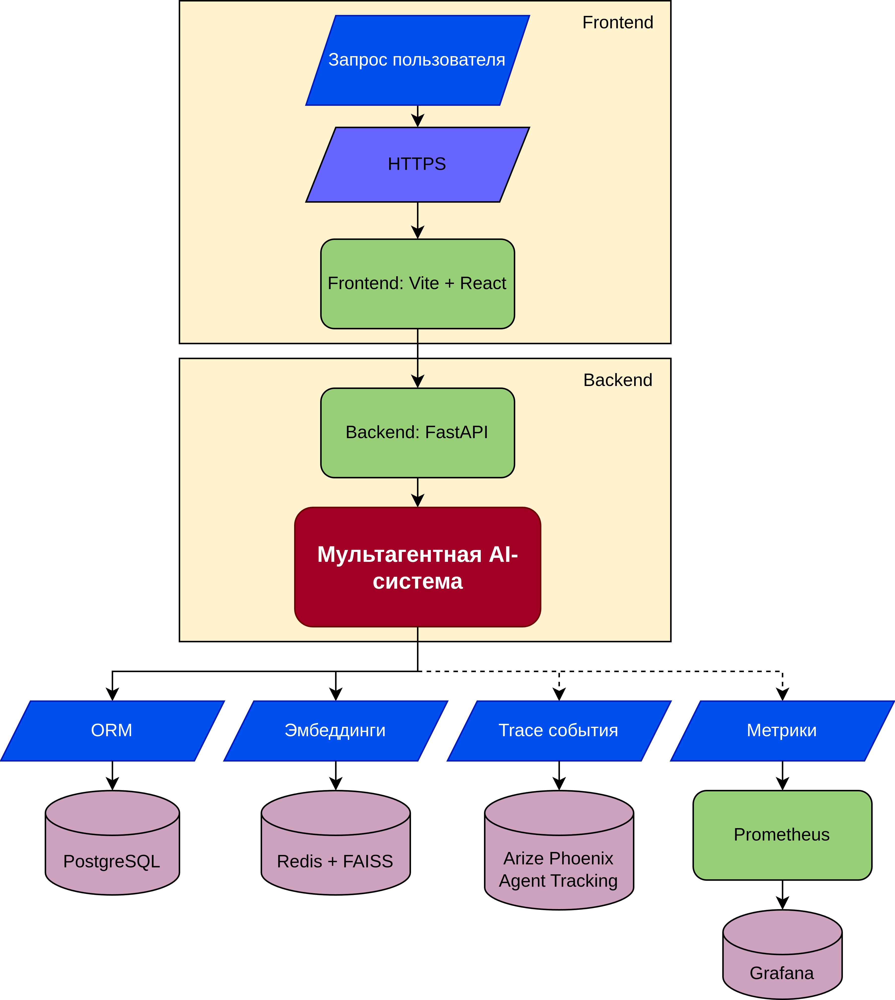
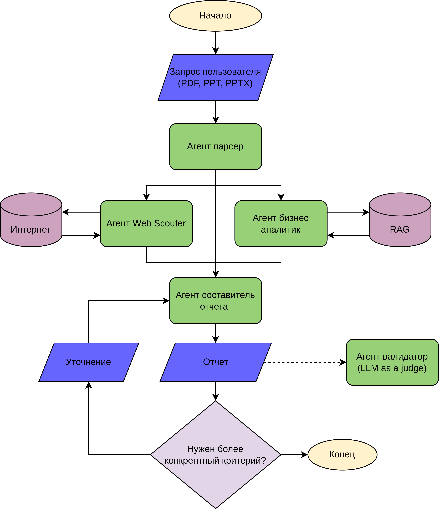

**Команда JaJaBinx** 

# IDEA: Investment Diligence Expert Assistant
Решение доступно по ссылке: `idea-msk.space`


## Инструкция по запуску
```commandline
git clone https://github.com/RodionovIV/rfb-ai-assistan.git
cd rfb-ai-assistan/
docker-compose up --build
```
Либо
```commandline
docker compose build && docker compose up
```

После этого можно обратиться к UI системы по https://localhost:5173

## Архитектура решения
Архитектура решения представлена в виде микросервисов:


Мультагентная AI-система:


## Пример использования (Скрин-каст)


## Презентация
src/JaJaBinx.pptx

